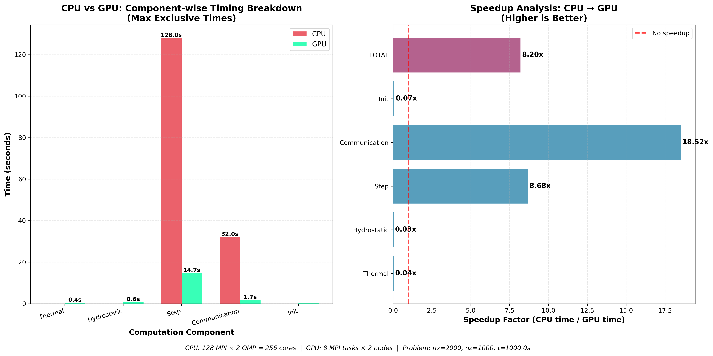
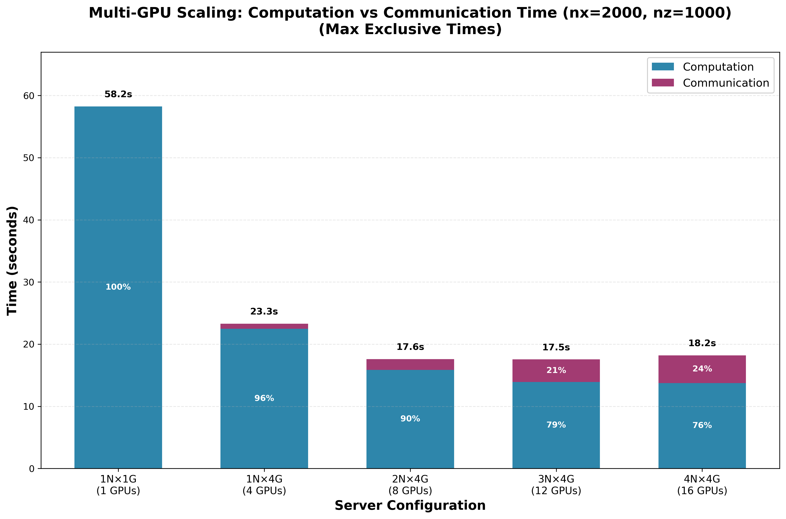

# miniWeather — MPI / OpenMP / OpenACC Port and Performance Study

Taking a serial Fortran atmospheric mini-app from **190 s to 2.1 s on CPUs** and **8.2× again on GPUs**,
and building the software engineering — CI, containers, regression tests, profiling — needed to trust
the result.

Coursework for *P1.8 — Best Practices in Scientific Software Development*, Master in High Performance
Computing (ICTP / SISSA, Trieste), Nov–Dec 2025. Full write-up in
[`miniweather-port-presentation.pdf`](miniweather-port-presentation.pdf).


> **This is a presentation copy.** The project was developed by three people in
> [`prabhkodes/fightClub`](https://github.com/prabhkodes/fightClub) — that repository holds the full
> commit history, all 40 reviewed pull requests, and the raw Nsight Systems traces (~83 MB, omitted here
> to keep this clone small). Everything I claim below links to the pull request that carries it.

## Provenance

**The solver is not ours.** The 2-D compressible Euler dynamical core — finite-volume discretisation,
dimensional splitting, RK3, hyperviscosity — is [**miniWeather**](https://github.com/mrnorman/miniWeather)
by Matthew R. Norman (ORNL 2018, NVIDIA 2021), used under its BSD licence
([`code/serial/LICENSE`](code/serial/LICENSE)). It is written as a parallel-programming training app.

The work here is the port, the engineering around it, and the measurement.

## Scope of work

| | |
|---|---|
| Understand the source | Refactor a single-file solver into typed Fortran modules |
| Parameterise | Accept grid size, simulation length and output frequency from the command line |
| Shared memory | OpenMP threading |
| Distributed | MPI domain decomposition + OpenMP |
| Heterogeneous | MPI + OpenACC GPU offload |
| I/O | Parallel NetCDF output |
| Build | CMake with automated testing |
| Docs | Doxygen |
| Delivery | Containerisation and continuous integration |

## Process

### Git workflow

Every change went `feature branch → pull request onto dev`, and a PR merged only when **both** gates
passed: at least one peer approval, and a green CI run. `dev` was the integration branch; releases went
out as a `dev → main` PR. Two tagged releases — *Parallelisation Using OpenMPI + OpenMP*, then
*Parallelisation Using OpenMPI + OpenACC*.

40 pull requests across three developers. Merge conflicts were resolved in the PR, not by force-pushing
over each other — [#49](https://github.com/prabhkodes/fightClub/pull/49) is a worked example, reconciling
OpenACC halo-buffer lifetimes against concurrent changes on `dev`.

### Continuous integration

[`.github/workflows/ci.yml`](.github/workflows/ci.yml) runs on every push to `dev`/`main` and on every
PR: checkout → set up Docker Buildx → build the image with the GitHub Actions cache as buildx backend →
run `make test` inside the container. Full pipeline is about 50 seconds, so review was never blocked on
waiting for it.

Building the *image* rather than compiling directly is what makes it reproducible — the same container
runs locally, in CI, and on the cluster via Singularity, so "works on my machine" never entered the
conversation.

### Testing

Two independent checks, both wired into `make test` via CTest:

1. **Physical conservation.** The model reports fractional change in total mass and total energy. The
   test passes only if mass drift `< 1e-13` and energy drift `< 1e-3` — energy is looser because
   hyperviscosity deliberately dissipates. This catches a broken parallelisation immediately: a bad halo
   exchange shows up as mass appearing or vanishing.
2. **Bitwise-ish output comparison.** `nccmp3.py` compares the generated NetCDF against two reference
   runs and reports, per variable, the ratio of run-to-reference difference against
   reference-to-reference difference. Ratios below 2.0 pass.

Both ran against every configuration — serial, OpenMP, MPI+OpenMP, and multi-GPU — so a GPU result that
diverged from the CPU result was caught rather than shipped.

### Build system

CMake with a `USE_OPENACC` option switching the whole toolchain between GNU/OpenMP and NVHPC/OpenACC:
NetCDF flags discovered through `nf-config`/`nc-config`, `enable_testing()` + `add_test()` for the suite
above, and a `doc` target driving Doxygen. One tree, three build configurations, no hand-edited makefiles.

### Documentation

Doxygen with call graphs, generated by `make doc`. Every module and public routine carries `@brief`/
`@details` comments.

## Method

The optimisation loop was deliberately boring and repeated:

```
profile  →  identify hot spots  →  change code  →  re-check scaling  →  repeat
```

**Profile first.** `perf stat` on the serial build: 256 s wall, 2.02 trillion instructions, 2.40
instructions per cycle, 3.01% L1-d miss, 3.06% LLC miss — but **74.6% bad speculation**, which is the
real story. The code was not memory-starved, it was branch-bound.

**Then instrument.** A scoped timer (`CTimer`) using a Fortran `final` binding, so a timer stops when it
leaves scope rather than needing a matching `stop` call on every exit path. It records named regions on
every rank and reduces to per-routine max total, max exclusive, average and call count — reporting the
*slowest* rank per routine, not rank 0. Timing covers **computation and communication**; file I/O is
excluded deliberately, since it would otherwise dominate and hide the thing being optimised.

That immediately localised the cost: `Computation: step` was 190.08 s of a 190.10 s run — 99.99%. Every
subsequent decision followed from that one number.

**On GPU, add NVTX.** Ranges pushed around data transfers and compute regions, so Nsight Systems traces
show `Halo Exchange X`, `X-Direction Tendency` and `Runge-Kutta Integration` as named spans per rank
rather than anonymous kernels. That is how the communication/computation overlap gap was found.

## Parallelisation

**Instruction-level → shared memory.** The tendency stencils were restructured so the inner loops carry
no cross-iteration dependence, then annotated `!$omp parallel do` with explicit `private` clauses and
`collapse(2)` on the flux-divergence loops.

**Distributed memory.** 1-D domain decomposition along *x* — `setup_domain_decomposition` splits the
global grid, distributes the remainder across the first ranks so load stays balanced when `nx` doesn't
divide evenly, and wires up periodic neighbours. Halos exchange through **non-blocking**
`MPI_Irecv`/`MPI_Isend` with a single `MPI_Waitall`; mass and energy reduce globally through
`MPI_Allreduce`.

**GPU offload.** OpenACC, with data residency managed explicitly: `enter data create/copyin/attach` at
setup, `update self` only when output is actually needed, `exit data delete` at teardown. Compute regions
are `!$acc parallel loop collapse(2..3) present(...)` — `present` rather than implicit copies, so nothing
silently round-trips per timestep.

Halo exchange uses **`!$acc host_data use_device(...)`**, handing device pointers straight to MPI so
GPU-aware MPI moves buffers device-to-device without staging through host memory. Halo buffers are
allocated once with `enter data create` and kept resident.

## Results

### CPU — NX = 400, Leonardo Booster

| Configuration | Time | Speedup |
|---|---:|---:|
| 1 node, 1 rank, 1 thread (baseline) | 190.1 s | 1× |
| 1 node, 1 rank, 8 threads | 37.3 s | 5.1× |
| 1 node, 1 rank, 32 threads | 18.2 s | 10.4× |
| 1 node, 4 ranks × 8 threads | 9.5 s | 20.0× |
| 4 nodes, 64 ranks × 2 threads | 2.68 s | 70.9× |
| **8 nodes, 16 ranks × 2 threads** | **2.14 s** | **88.8×** |

Hybrid MPI+OpenMP beat pure OpenMP at equal core count on a single node — 9.5 s against 18.2 s — because
NUMA locality matters on these nodes; four ranks pinned to their own memory beat one rank spanning the
socket. Ranks were pinned with `OMP_PROC_BIND=close` and `OMP_PLACES=cores`.

### Multi-GPU — nx = 2000, nz = 1000

| GPUs | Config | Time | Communication share |
|---:|---|---:|---:|
| 1 | 1 node × 1 | 58.2 s | 0% |
| 4 | 1 node × 4 | 23.3 s | 4% |
| 8 | 2 nodes × 4 | 17.6 s | 10% |
| 12 | 3 nodes × 4 | 17.5 s | 21% |
| 16 | 4 nodes × 4 | 18.2 s | 24% |

Scaling stops at 8 GPUs, and the timer says exactly why: communication climbs from 0% to 24% of runtime
as the per-device subdomain shrinks. Past 8 GPUs the halo exchange costs more than the compute it saves.
This is the single clearest argument for the retrospective item below — overlapping communication with
computation is the obvious next optimisation.




### CPU vs GPU, component by component

CPU: 128 MPI ranks × 2 OpenMP threads = 256 cores. GPU: 8 ranks across 2 nodes. nx = 2000, nz = 1000.

| Component | CPU | GPU | Speedup |
|---|---:|---:|---:|
| Step (main loop) | 128.0 s | 14.7 s | **8.68×** |
| Communication | 32.0 s | 1.7 s | **18.52×** |
| Thermal | 0.4 s | — | 0.04× |
| Hydrostatic | 0.6 s | — | 0.03× |
| Init | — | — | 0.07× |
| **Total** | | | **8.20×** |

The setup routines are 25–30× *slower* on GPU — they run once, aren't offloaded, and pay device
initialisation. That doesn't matter at production run lengths, but it is worth stating plainly rather
than quoting the total alone. Communication improves 18.5× mostly because 8 ranks exchange far less than
128 do.

### CPU baseline profile

`perf stat`: 2.40 IPC, 3.01% L1-d miss, 3.06% LLC miss, **74.6% bad speculation**. Full counters in
[`perf_results/base_perf.txt`](perf_results/base_perf.txt).

## My contribution — @prabhkodes

| What | Where | PRs |
|---|---|---|
| **Parallel timing framework** — written from scratch. Scoped `CTimer` with a Fortran `final` binding; per-routine max / exclusive / average / call count reduced across all ranks. Every performance number in this repo was measured with it. | [`parallel_timer.f90`](code/serial/parallel_timer.f90) | [#3](https://github.com/prabhkodes/fightClub/pull/3) [#14](https://github.com/prabhkodes/fightClub/pull/14) [#17](https://github.com/prabhkodes/fightClub/pull/17) |
| **Parallel NetCDF output** — authored the module. Per-rank hyperslab writes into one shared file, unlimited time dimension. | [`module_output.F90`](code/serial/module_output.F90) | [#30](https://github.com/prabhkodes/fightClub/pull/30) [#36](https://github.com/prabhkodes/fightClub/pull/36) |
| **OpenMP threading of the tendency stencils** — the *x*/*z* tendency loops, innermost hot loops of the RK stages. | `module_types.F90` | [#20](https://github.com/prabhkodes/fightClub/pull/20) |
| **MPI ↔ OpenACC integration** — reconciled the distributed and GPU branches into one source tree building CPU-only, MPI+OpenMP and MPI+OpenACC. | 6 files | [#34](https://github.com/prabhkodes/fightClub/pull/34) |
| **Benchmark harness and the scaling campaign** — I/O-free benchmark mode, SLURM sweeps, every CPU and multi-GPU run above, `perf` collection. | `submit_sweep.sh`, `nvtx_batch.sh` | [#39](https://github.com/prabhkodes/fightClub/pull/39) [#21](https://github.com/prabhkodes/fightClub/pull/21) [#25](https://github.com/prabhkodes/fightClub/pull/25) [#43](https://github.com/prabhkodes/fightClub/pull/43) [#46](https://github.com/prabhkodes/fightClub/pull/46) |
| **Integration and release** — merged the team's PRs, cut both releases to `main`. | — | [#52](https://github.com/prabhkodes/fightClub/pull/52) [#54](https://github.com/prabhkodes/fightClub/pull/54) |

Not mine: the **OpenACC port** is Emilio's ([#32](https://github.com/prabhkodes/fightClub/pull/32)
[#37](https://github.com/prabhkodes/fightClub/pull/37) [#42](https://github.com/prabhkodes/fightClub/pull/42)
[#49](https://github.com/prabhkodes/fightClub/pull/49)); **CMake, Doxygen and the regression test** are
Franco's ([#26](https://github.com/prabhkodes/fightClub/pull/26)
[#40](https://github.com/prabhkodes/fightClub/pull/40) [#44](https://github.com/prabhkodes/fightClub/pull/44)).

Three developers: [@RaionG18](https://github.com/RaionG18) (Emilio Gordillo) ·
[@formidablefrank](https://github.com/formidablefrank) (J. Franco Ray) ·
[@prabhkodes](https://github.com/prabhkodes) (Prabhsharan Singh).

## Retrospective

**Worked.** PR-based review with CI as a hard gate. Automated testing from early on — the conservation
check caught parallelisation bugs that would otherwise have surfaced as subtly wrong physics much later.
Documentation written alongside the code rather than at the end.

**Would do differently.** Overlap communication with computation — the multi-GPU numbers above show
exactly what that is worth. And run the test suite on the cluster from CI, not just in a container on
GitHub's runners, so cluster-only build and toolchain failures get caught by the pipeline.

**Practical lessons.** Module load order matters and produces baffling link errors when wrong. Dedicate
one GPU per rank. Check results every single time, not just when something looks wrong. Profile even when
the code appears to work — the 74.6% bad-speculation figure was invisible until measured.

## Build and run

Needs `cmake`, `gfortran` (or `nvfortran`), MPI, `netcdf-fortran`; `doxygen`/`graphviz` for docs.
`./runenv.sh` gives you all of it in Docker instead.

```bash
cd code/serial && mkdir build && cd build
cmake ..                      # MPI + OpenMP
cmake .. -DUSE_OPENACC=ON     # MPI + OpenACC, on a GPU system
make -j4
make test                     # conservation + NetCDF regression
mpirun -n 4 ./model 100 1000 10   # nx, timesteps, output frequency
```

Writes `output.nc` — view with `ncview` or VisIt. SLURM scripts for Leonardo (native, containerised,
InfiniBand-forced, Nsight-profiling) are in [`code/serial/`](code/serial/).

---

## Layout

```
code/
  serial/          model source, CMake project, SLURM scripts, Doxygen config
  results/         plots, run logs
perf_results/      CPU performance counter statistics
.github/workflows/ci.yml    containerised regression tests
Dockerfile         build and run environment
runenv.sh          initialise the containerised environment
```

| Source file | Contents |
|---|---|
| `model.F90` | Main driver — initialisation, RK time stepping, diagnostics |
| `module_physics.f90` | Initial and boundary conditions, numerical solution, mass and energy budgets |
| `module_types.F90` | Atmospheric state, flux and tendency types; halo exchange |
| `module_parameters.f90` | Domain decomposition and solver parameters, physical constants |
| `module_output.F90` | Parallel NetCDF output |
| `parallel_timer.f90` | Per-routine timing reduced across all ranks |
| `module_nvtx.f90` | NVTX range annotations for Nsight Systems |

## Running on Leonardo
You can see the slurm scripts to see how the program was built and run on the cluster:
- `cpu_model.sh`, `gpu_model.sh`
- `serial/batch.sh`, `serial/gpu_batch.sh`, `serial/gpu.sh`

Sample command to upload your files to the cluster. This assumes that you have SSH key acquired from `step`:
```bash
rsync -arvzP code leo:/leonardo_scratch/large/userexternal/jrayo000
```

### Project Path
```bash
/leonardo/pub/userexternal/jgordill/fightClub
```

### Modules
#### MPI+OpenMP
```bash
module purge

# Compiler
module load cmake/3.27.9
module load gcc/12.2.0

# MPI
module load openmpi/4.1.6--gcc--12.2.0-cuda-12.2

# NetCDF Fortran
module load netcdf-fortran/4.6.1--openmpi--4.1.6--gcc--12.2.0-spack0.22

```

### MPI+OpenACC
```bash
module purge

# Compiler
module load cmake/3.27.9
module load nvhpc/24.5

# MPI
module load hpcx-mpi/2.19

# NetCDF Fortran
module load netcdf-fortran/4.6.1--hpcx-mpi--2.19--nvhpc--24.5
module load binutils/2.42
```

### Python (for running output comparison test)
Load packages
```bash
module purge

module load python/3.11
module load gcc/12.2.0
module load openmpi/4.1.6--gcc--12.2.0-cuda-12.2
module load netcdf-c/4.9.2--openmpi--4.1.6--gcc--12.2.0-spack0.22
module load parallel-netcdf/1.12.3--openmpi--4.1.6--gcc--12.2.0-spack0.22
```

Create virtual environment and install packages. You may also have the option not to explicitly activate/deactivate the virtual env by directly using the executable files inside.
```bash
python3 -m venv pyenv
pyenv/bin/pip install numpy netCDF4
```

Run the program
```bash
pyenv/bin/python nccmp3.py output-serial.nc output-serial-optimized.nc output.nc
```

---

## Licence

miniWeather is BSD-licensed by ORNL and NVIDIA ([`code/serial/LICENSE`](code/serial/LICENSE)).
Modifications are released under the same terms.
