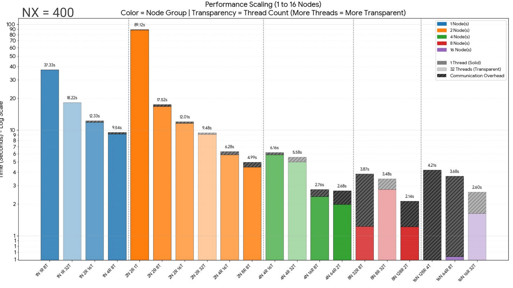
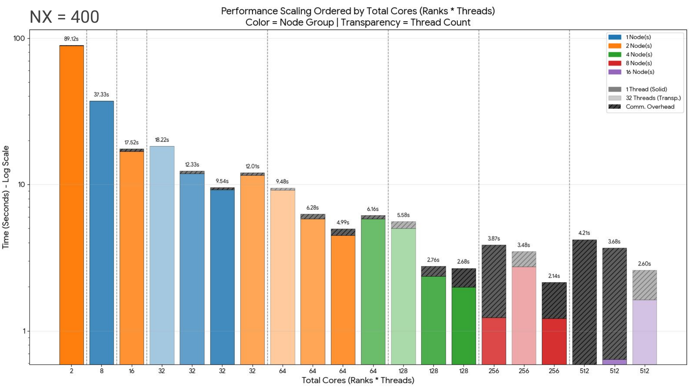

# miniWeather — MPI / OpenMP / OpenACC port

Taking an existing serial Fortran weather model and making it run on 256 CPU cores and on 16 GPUs.

| | |
|---|---:|
| CPU | 190 s → **2.1 s** (88.8×, 256 cores) |
| GPU | **8.2×** again over 256 CPU cores |
| Team | 3 developers, 40 reviewed PRs |
| Course | *P1.8 Best Practices in Scientific Software Development*, MHPC ICTP/SISSA, Nov–Dec 2025 |

**Stack:** Fortran · MPI · OpenMP · OpenACC · NetCDF · CMake · Docker · GitHub Actions · Nsight
Systems / NVTX · `perf` · SLURM

**Where it ran:** every number below is from **Leonardo Booster** at CINECA — Intel Ice Lake Xeon 8358,
32 cores per node, 4× A100 64 GB per node, 200 Gbps HDR InfiniBand. CPU runs to 16 nodes (512 cores),
GPU runs to 16 A100s.

Full write-up in [`docs/presentation.pdf`](docs/presentation.pdf).


> **This is a presentation copy.** The project was developed in
> [`prabhkodes/fightClub`](https://github.com/prabhkodes/fightClub) — full history, all 40 pull
> requests, and the raw Nsight traces (~83 MB, omitted here). Every claim below links to its PR.

## Where the source code comes from

> **We did not write the solver.**

| | |
|---|---|
| Solver | [**miniWeather**](https://github.com/mrnorman/miniWeather) by Matthew R. Norman |
| Copyright | Oak Ridge National Laboratory (2018), NVIDIA (2021) |
| Licence | BSD — kept in [`LICENSE`](LICENSE) |
| Norman wrote | 2-D compressible Euler equations, finite-volume discretisation with 4th-order flux interpolation, dimensional splitting, RK3, hyperviscosity |
| Why it exists | It's written to be a teaching code for parallel programming — which is exactly what we used it for |

## What we did

| Area | Work |
|---|---|
| **Refactor** | Split the single-file solver into typed Fortran modules |
| **OpenMP** | Threaded the tendency stencils — the hot loops of the RK stages |
| **MPI** | 1-D domain decomposition in *x*, non-blocking halo exchange, `Allreduce` for conservation |
| **OpenACC** | GPU offload, explicit device data residency, one GPU per rank, GPU-aware MPI |
| **Parallel I/O** | NetCDF, per-rank hyperslab writes into one shared file |
| **Build** | CMake — one tree, three configurations (CPU-only, MPI+OpenMP, MPI+OpenACC) |
| **CI** | GitHub Actions — builds the Docker image, runs the test suite on every push and PR |
| **Tests** | Mass/energy conservation thresholds + NetCDF output comparison, wired into CTest |
| **Profiling** | `perf` counters, an MPI-wide timing framework, NVTX ranges for Nsight Systems |
| **Docs** | Doxygen with call graphs |

## Results

### What is actually being measured

Everything is **double precision** (`wp = real64`, 8 bytes). Four prognostic variables — density,
*x*-momentum, *z*-momentum, ρθ. Halo of 2 cells, fourth-order stencil. Domain fixed at 20 km × 10 km,
so `nz = nx/2` and `dt = 1.5·dx/450` follow from the CFL condition.

| | NX = 400 (CPU runs) | nx = 2000, nz = 1000 (GPU runs) |
|---|---:|---:|
| Cells | 80,000 | 2,000,000 |
| dx, dt | 50 m, 0.1667 s | 10 m, 0.0333 s |
| Simulated time / timesteps | 1000 s / 6,000 | 500 s / 15,000 |
| 2 × state, `(nx+4)(nz+4)·4` | 5.0 MiB | 122.8 MiB |
| flux `(nx+1)(nz+1)·4` | 2.5 MiB | 61.1 MiB |
| tendency `nx·nz·4` | 2.4 MiB | 61.0 MiB |
| **Working set** | **10.0 MiB** | **245.2 MiB** |
| Cell-updates | 4.8 × 10⁸ | 3.0 × 10¹⁰ |
| FLOPs (≈) | 274 GFLOP | 17.1 TFLOP |

- The 10 MiB working set at NX = 400 **fits in L3** on these nodes
- Which is why the serial profile shows only a 3.01% L1-d miss rate but **74.6% bad speculation**

→ **The bottleneck is branching, not memory.**

FLOP counts are hand-counted from the stencil body: ~87 flops per cell per directional sweep, six
sweeps per timestep (3 RK stages × 2 directions), plus the state update. Divisions count as one, the
`**cdocv` power is left out — take it as ±20% and a lower bound.

### CPU, NX = 400 — OpenMP and MPI+OpenMP



19 configurations from 1 to 16 nodes. Colour is node count, lighter shading means more threads per
rank, hatching on top is communication. Log scale. `N` = nodes, `R` = MPI ranks, `T` = OpenMP threads.

The same runs ordered by total cores instead of node count:



| Configuration | Cores | Time | Speedup | Mcell-upd/s | GFLOP/s |
|---|---:|---:|---:|---:|---:|
| 1 rank, 1 thread (baseline) | 1 | 190.1 s | 1× | 2.5 | 1.4 |
| 1N 1R 8T | 32 | 37.3 s | 5.1× | 12.9 | 7.3 |
| 1N 1R 32T | 32 | 18.2 s | 10.4× | 26.3 | 15.0 |
| 1N 4R 8T | 32 | 9.5 s | 19.9× | 50.3 | 28.7 |
| 2N 8R 8T | 64 | 4.99 s | 38.1× | 96.2 | 54.8 |
| 4N 16R 8T | 128 | 2.76 s | 68.9× | 173.9 | 99.1 |
| 4N 64R 2T | 128 | 2.68 s | 70.9× | 179.1 | 102.1 |
| **8N 128R 2T** | **256** | **2.14 s** | **88.8×** | **224.3** | **127.9** |
| 16N 16R 32T | 512 | 2.60 s | 73.1× | 184.6 | 105.2 |

**Ranks beat threads at the same core count.**

- Four bars sit at 32 cores in the second plot, ranging **9.54 s to 18.22 s**
- Same hardware, **1.9× apart**, purely from the rank/thread split
- 4 ranks × 8 threads wins; 1 rank × 32 threads loses
- Four ranks each sit in their own NUMA domain; one rank spread across the socket keeps reaching into
  memory attached to a different one

**Getting the split wrong costs more than adding hardware saves.**

- 2N 2R 1T — two nodes, one thread per rank — took **89.1 s**
- Worse than a single node doing almost anything else
- Two ranks on 64 cores leaves 62 of them idle

**Past 8 nodes it gets slower.**

- Best is 2.14 s on 8 nodes; 16 nodes gives 2.60 s
- The hatched communication block grows until at 16 nodes it's most of the runtime
- At NX=400 the grid is 80,000 cells, so 512 cores own ~156 cells each
- More time exchanging halos than updating them

### Multi-GPU, nx = 2000, nz = 1000

| GPUs | Config | Time | Communication share |
|---:|---|---:|---:|
| 1 | 1 node × 1 | 58.2 s | 0% |
| 4 | 1 node × 4 | 23.3 s | 4% |
| 8 | 2 nodes × 4 | 17.6 s | 10% |
| 12 | 3 nodes × 4 | 17.5 s | 21% |
| 16 | 4 nodes × 4 | 18.2 s | 24% |

- Communication goes from 0% to **24%** of runtime as each GPU gets a smaller piece
- At 16 GPUs a card holds 15 MiB and barely does any work per timestep
- The halo exchange still costs the same

→ **Scaling stops at 8 GPUs.** The fix is overlapping communication with computation. We didn't get to it.


### CPU vs GPU, per component

128 MPI × 2 OMP (256 cores) against 8 GPUs on 2 nodes, nx = 2000, nz = 1000, 1000 s simulated.

| Component | CPU | GPU | Speedup |
|---|---:|---:|---:|
| Step (main loop) | 128.0 s | 14.7 s | **8.68×** |
| Communication | 32.0 s | 1.7 s | 18.52× |
| Init / thermal / hydrostatic | — | — | 0.03–0.07× |
| **Total** | | | **8.20×** |

- Setup routines are **25–30× slower** on GPU — they run once, aren't offloaded, and pay device init
- Over a real run length that doesn't matter, but it's there
- Communication looks 18.5× better mostly because 8 ranks have far less to exchange than 128

### CPU baseline profile

| Counter | Value |
|---|---:|
| Instructions | 2.02 trillion |
| IPC | 2.40 |
| L1-d miss | 3.01% |
| LLC miss | 3.06% |
| **Bad speculation** | **74.6%** |

Full counters in [`results/cpu/base_perf.txt`](results/cpu/base_perf.txt).

## My part — @prabhkodes

| What | Where | PRs |
|---|---|---|
| **Parallel timing framework**, written from scratch. Scoped timer using a Fortran `final` binding. Reports per-routine max / exclusive / average / call count across all ranks, and names the slowest rank per routine. Every number on this page was measured with it. | [`src/parallel_timer.f90`](src/parallel_timer.f90) | [#3](https://github.com/prabhkodes/fightClub/pull/3) [#14](https://github.com/prabhkodes/fightClub/pull/14) [#17](https://github.com/prabhkodes/fightClub/pull/17) |
| **Parallel NetCDF output.** Wrote the module — hyperslab writes with per-rank offsets from the decomposition, unlimited time dimension. | [`src/module_output.F90`](src/module_output.F90) | [#30](https://github.com/prabhkodes/fightClub/pull/30) [#36](https://github.com/prabhkodes/fightClub/pull/36) |
| **OpenMP threading** of the *x*/*z* tendency stencils. | `src/module_types.F90` | [#20](https://github.com/prabhkodes/fightClub/pull/20) |
| **Merged the MPI and OpenACC branches** into one source tree building all three configurations. | 6 files | [#34](https://github.com/prabhkodes/fightClub/pull/34) |
| **Benchmark harness and the whole scaling campaign** — I/O-free benchmark mode, SLURM sweeps, every run in the tables above, `perf` collection. | `scripts/slurm/` | [#39](https://github.com/prabhkodes/fightClub/pull/39) [#43](https://github.com/prabhkodes/fightClub/pull/43) [#46](https://github.com/prabhkodes/fightClub/pull/46) |
| **Integration and releases** — merged the team's PRs, cut both releases to `main`. | — | [#52](https://github.com/prabhkodes/fightClub/pull/52) [#54](https://github.com/prabhkodes/fightClub/pull/54) |

**Not mine.** The OpenACC port is Emilio's ([#32](https://github.com/prabhkodes/fightClub/pull/32),
[#37](https://github.com/prabhkodes/fightClub/pull/37),
[#42](https://github.com/prabhkodes/fightClub/pull/42),
[#49](https://github.com/prabhkodes/fightClub/pull/49)). CMake, Doxygen and the NetCDF regression test
are Franco's ([#26](https://github.com/prabhkodes/fightClub/pull/26),
[#40](https://github.com/prabhkodes/fightClub/pull/40),
[#44](https://github.com/prabhkodes/fightClub/pull/44)).

[@RaionG18](https://github.com/RaionG18) Emilio Gordillo ·
[@formidablefrank](https://github.com/formidablefrank) J. Franco Ray ·
[@prabhkodes](https://github.com/prabhkodes) Prabhsharan Singh

This is a presentation copy. The project was built in
[`prabhkodes/fightClub`](https://github.com/prabhkodes/fightClub), which has the full history, all 40
pull requests, and the raw Nsight traces (~83 MB, left out here).

## How the work was run

### Git

| | |
|---|---|
| Flow | Feature branch → PR onto `dev` |
| Merge gate | A peer approval **and** a green CI run — both required |
| Releases | `dev → main` PRs. Two tagged: MPI+OpenMP, then MPI+OpenACC |
| Volume | 40 PRs across three people |
| Conflicts | Resolved in the PR, not by force-pushing over each other — [#49](https://github.com/prabhkodes/fightClub/pull/49) is a worked example |

### CI

[`.github/workflows/ci.yml`](.github/workflows/ci.yml) runs on every push to `dev`/`main` and every PR:

1. Checkout
2. Set up Docker Buildx
3. Build the image, GitHub Actions cache as buildx backend
4. Run the tests inside the container

- ~50 seconds end to end, so review never waited on it
- Building the **image** rather than compiling directly is what keeps local, CI and cluster the same

### Tests

| Check | What it catches |
|---|---|
| **Conservation** — mass drift < 1e-13, energy drift < 1e-3 | A broken halo exchange shows up straight away as mass appearing or disappearing |
| **Output comparison** — `nccmp3.py` against reference NetCDF | A GPU result drifting from the CPU one |

Both run on every configuration — serial, OpenMP, MPI+OpenMP, multi-GPU.

> **Note:** the reference `.nc` files were never committed, so the comparison currently no-ops and only
> the conservation check runs. Worth fixing.

### Profiling

The loop: **profile → find the hot spot → change it → re-check scaling → repeat.**

| Tool | What it found |
|---|---|
| `perf stat` on the serial build | 74.6% bad speculation — branch-bound, not memory-starved |
| The MPI-wide timer | `Computation: step` was 190.08 s of a 190.10 s run — **99.99%** |
| NVTX + Nsight Systems | Named spans per rank (`Halo Exchange X`, `Runge-Kutta Integration`) instead of unnamed kernels |

- Everything after the timer result went into one routine
- The timer covers computation and communication, and deliberately **skips file I/O** — it would
  otherwise dominate and hide what we were trying to fix

## Implementation notes

| Piece | How |
|---|---|
| **Domain decomposition** | `setup_domain_decomposition` splits the grid in *x*, spreads the remainder across the first ranks so load stays even when `nx` doesn't divide cleanly, wires up periodic neighbours |
| **Halo exchange** | Non-blocking `MPI_Irecv`/`MPI_Isend`, single `MPI_Waitall`. Mass and energy reduce with `MPI_Allreduce` |
| **GPU data residency** | `enter data create/copyin/attach` at setup, `update self` only when output is needed, `exit data delete` at teardown |
| **No hidden copies** | Compute regions use `present(...)` instead of implicit copies, so nothing quietly copies back and forth every timestep |
| **GPU-aware MPI** | `!$acc host_data use_device(...)` hands device pointers straight to MPI — buffers move device-to-device without staging through the host. Halo buffers allocated once, stay resident |

## What we'd do differently

- **Overlap communication with computation.** The multi-GPU table shows exactly what that's worth
- **Run the tests on the cluster from CI**, not just in a container on GitHub's runners, so
  cluster-only toolchain failures get caught by the pipeline instead of by a person

Smaller lessons:

- Module load order matters, and gives confusing link errors when wrong
- One GPU per rank
- Check results every time, not just when something looks off
- Profile even when the code seems fine — nobody would have guessed the 74.6% bad speculation without
  measuring it

## Build and run

- Needs `cmake`, `gfortran` or `nvfortran`, MPI, `netcdf-fortran`; `doxygen` and `graphviz` for docs
- [`scripts/runenv.sh`](scripts/runenv.sh) gives you all of it in Docker instead
- Verified on macOS/arm64 (gfortran 14, Open MPI 5.0, netcdf-fortran 4.6) and in the Ubuntu 22.04
  container CI uses

```bash
cmake -S . -B build                      # MPI + OpenMP
cmake -S . -B build -DUSE_OPENACC=ON     # MPI + OpenACC
cmake --build build -j
ctest --test-dir build --output-on-failure
mpirun -n 4 ./build/model 100 1000 10    # nx, timesteps, output frequency
```

- Writes `output.nc` — open with `ncview` or VisIt
- `cmake --build build --target doc` builds the Doxygen docs into `build/doc/html/`

### Running on Leonardo

Batch scripts in [`scripts/slurm/`](scripts/slurm/) — `cpu_omp.sh`, `gpu.sh`, `gpu_batch.sh`,
`submit_sweep.sh` — and [`scripts/profiling/nvtx_batch.sh`](scripts/profiling/nvtx_batch.sh) for Nsight.

**MPI + OpenMP**

```bash
module purge
module load cmake/3.27.9 gcc/12.2.0
module load openmpi/4.1.6--gcc--12.2.0-cuda-12.2
module load netcdf-fortran/4.6.1--openmpi--4.1.6--gcc--12.2.0-spack0.22
```

**MPI + OpenACC**

```bash
module purge
module load cmake/3.27.9 nvhpc/24.5 hpcx-mpi/2.19
module load netcdf-fortran/4.6.1--hpcx-mpi--2.19--nvhpc--24.5
module load binutils/2.42
```

Rank pinning used `OMP_PROC_BIND=close` and `OMP_PLACES=cores`.

## Layout

```
CMakeLists.txt          single build system; -DUSE_OPENACC=ON switches toolchain
Dockerfile
LICENSE                 miniWeather BSD licence (ORNL / NVIDIA)
src/                    Fortran sources
tests/                  NetCDF comparator, Python requirements
scripts/
  runenv.sh             build the image and shell into it
  slurm/                Leonardo batch scripts and the scaling sweep
  profiling/            Nsight / NVTX job scripts
docs/                   Doxyfile, CSS, physics notes, presentation
results/
  plots/                figures used above
  cpu/                  CPU run logs and perf counters
  gpu/                  multi-GPU run logs, Nsight session view
  analysis/             the plotting scripts that made the figures
.github/workflows/      containerised CI
```

| Source file | Contents |
|---|---|
| `model.F90` | Main driver — init, RK time stepping, diagnostics |
| `module_physics.f90` | Initial and boundary conditions, solution, mass/energy budgets |
| `module_types.F90` | State, flux and tendency types; halo exchange |
| `module_parameters.f90` | Decomposition and solver parameters, physical constants |
| `module_output.F90` | Parallel NetCDF output |
| `parallel_timer.f90` | Per-routine timing across all ranks |
| `module_nvtx.F90` | NVTX ranges; no-ops when built without NVTX |

## Licence

miniWeather is BSD licensed by ORNL and NVIDIA — see [`LICENSE`](LICENSE). Our changes are under the
same terms.
